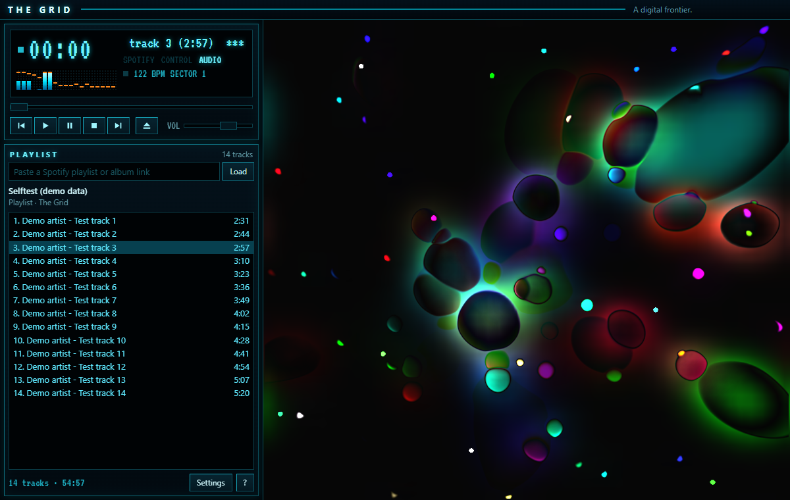
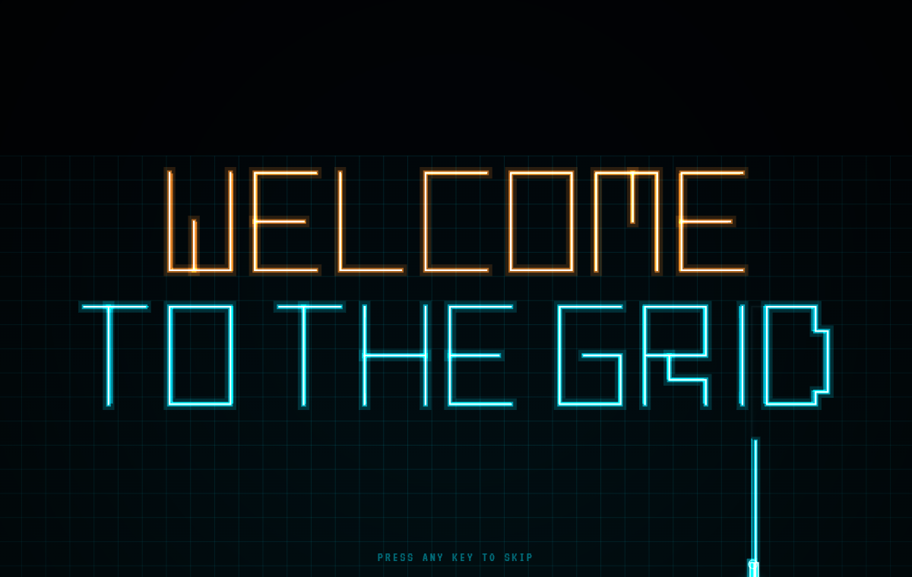

# The Grid

En lokal Windows-app, der opfører sig som klassisk Winamp med MilkDrop-visualizeren og ser ud som Tron. Indsæt et link til en Spotify-playliste, og The Grid viser den som en Winamp-playliste, spiller numrene i Spotify og visualiserer musikken med 395 originale MilkDrop-presets. Ved start kæmper 16 lyscykler på the Grid og elimineres én efter én, mens deres lysvægge skriver "WELCOME TO THE". De to sidste kæmper, og vinderen skriver "GRID".

Programmet hed tidligere Visamp.





## Sådan virker det

- **Musikken spiller i Spotify-appen** som normalt. The Grid styrer den via Spotify Web API.
- **The Grid lytter med på pc'ens lyd** via Windows' loopback og tegner den i realtid. Visualizeren virker derfor også med YouTube eller andet, der spiller.
- **Visualiseringen er MilkDrop 2**, Winamps berømte visualizer, via Butterchurn.
- **Den følger musikken som i Winamp.** Presets skifter på takten, når sangen går over i en ny del, og med hårde klip på drops. De vælges efter, om det er bassen, mellemtonen eller diskanten, der fylder lige nu. Uden musik er billedet sort. Se [docs/music_engine.md](docs/music_engine.md).
- **Altid på engelsk.** Tre temaer: The Grid (cyan), Clus regime (orange) og klassisk Winamp.
- **Første gang** guider appen igennem login, lydtjek og første playliste.

Spotify udleverer ikke rå lyd til andre programmer. Derfor analyserer The Grid den lyd, der allerede kommer ud af pc'en. Intet optages eller gemmes.

## Kom i gang

**Installationsfil:** kør `The-Grid-Setup-<version>.exe`. Vejledning på engelsk: [docs/en/getting_started.md](docs/en/getting_started.md).

**Fra kildekoden** (kræver Node.js 22.12 eller nyere):

```bash
npm install
node node_modules/electron/install.js   # henter Electron med det samme
npm start                               # eller dobbeltklik på "The Grid.cmd"
```

Spotify-delen kræver Spotify Premium. The Grid har Peters Spotify-udvikler-app bygget ind; hans app har højst 5 brugere, som han selv tilføjer. En egen udvikler-app kan sættes op under Indstillinger. Se [docs/spotify_setup.md](docs/spotify_setup.md). Uden login virker visualizeren stadig, og knapperne sender medietaster til Windows.

## Taster

| Afspilning (Winamp) | | Visualizer (MilkDrop) | |
|---|---|---|---|
| `Z` | Forrige | `→` / `←` | Næste / forrige preset med navn |
| `X` | Afspil | `Mellemrum` / `Backspace` | Næste / forrige preset uden navn |
| `C` | Pause | `H` | Skift uden overgang |
| `V` | Stop | `R` / `A` | Tilfældig / automatisk |
| `B` | Næste | `L` | Vælg preset |
| `Ctrl+L` | Nyt link | `F` | Fuld skærm, kun billedet |

`F1` viser alle genveje. Der er også påskeæg; hjælpen giver et hint.

## Udvikling

```bash
npm test           # 102 unit-tests
npm run musictest  # musikmotoren mod en syntetisk sang med kendt facit (lydløst)
npm run selftest   # afspiller en testlyd og tjekker lydfangst og rendering
npm run dist       # bygger installationsfilen i dist/
```

Se [CLAUDE.md](CLAUDE.md) og [docs/architecture.md](docs/architecture.md).

## Licenser og kreditering

- [Butterchurn](https://github.com/jberg/butterchurn) og [butterchurn-presets](https://github.com/jberg/butterchurn-presets) af Jordan Berg, MIT. Presets er lavet af deres respektive forfattere i MilkDrop-miljøet.
- MilkDrop 2 af Ryan Geiss/Nullsoft, BSD.
- Skrifttypen VT323 af Peter Hull, SIL Open Font License 1.1.
- Installationen har licenserne med i `THIRD_PARTY_NOTICES.txt`.
- The Grid er et fanprojekt og ikke tilknyttet Disney, Tron, Winamp, Nullsoft, Llama Group eller Spotify. Ingen Winamp-kode eller -grafik og ingen grafik fra Tron er brugt.
