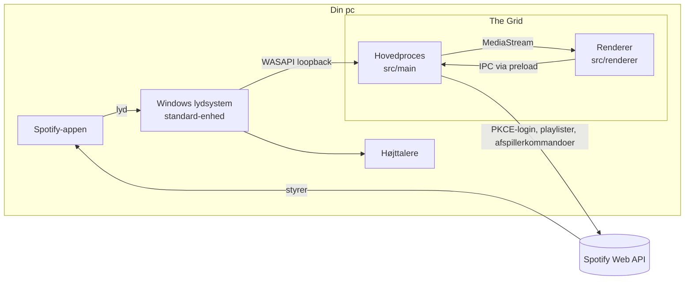

# Arkitektur

The Grid (tidligere Visamp) er en Electron-app, der kører lokalt på Windows. Den har tre dele, der hver har én opgave:

- **Spotify-appen spiller musikken.**
- **Windows sender lyden til The Grid via loopback.**
- **The Grid tegner lyden og styrer Spotify via Web API.**

## Processer

| Del | Filer | Ansvar |
|---|---|---|
| Hovedproces (Node) | `src/main/` | Vindue, lydfangst, Spotify-login og -API, lagring, medietaster, selvtest |
| Preload | `src/preload/preload.js` | Den eneste bro: udstiller `window.visamp` med `contextBridge` |
| Renderer (Chromium) | `src/renderer/` | Brugerflade, Web Audio, Butterchurn/WebGL, playliste og LCD |
| Delt | `src/shared/format.js` | Formatering af tid og titler. Bruges af rendereren og af tests. |
| `src/shared/i18n.js` | Alle tekster, brugeren ser (altid engelsk), og `t(nøgle, værdier)`. Bruges af rendereren, login-siden og tests. |
| `src/shared/grid-font.js` | Lyscykel-skriften: bogstaver af vandrette og lodrette streger, som introens cykler kører. |
| `src/shared/music-engine.js` | Musikmotoren: tempo, slag, dele af sangen, drops, stilhed, profiler af presets og instruktøren. Bruges af rendereren og af tests. |

Rendereren har ingen Node-adgang og laver ingen netværkskald. Alt Spotify-arbejde sker i hovedprocessen.

## Moduler i hovedprocessen

| Fil | Indhold |
|---|---|
| `main.js` | Starter appen, opretter vinduet, registrerer IPC-kanaler, tillader kun Spotify-adresser udadtil |
| `audio-capture.js` | `setDisplayMediaRequestHandler` giver systemlyd (`audio: 'loopback'`) og tillader kun få tilladelser |
| `audio-devices.js` | Holder øje med Windows' standard-afspilningsenhed via `ps/audio-watch.ps1` og melder skift, så lydfangsten kan startes forfra |
| `powershell.js`, `ps/` | Kører PowerShell-scripts som filer med `-File`. `ps/audio-watch.ps1` og `ps/audio-devices.cs` (Core Audio), `ps/mediakey.ps1` og `ps/play-wav.ps1` (selvtest). I den pakkede app ligger `ps/` i `app.asar.unpacked`. |
| `spotify-auth.js` | PKCE-login med loopback-server på `127.0.0.1:43117`, fornyelse af tokens |
| `pkce.js` | Kodeverifikator og challenge (RFC 7636) |
| `spotify-api.js` | Web API-kald, sideskift, fejl med koder og detaljer (oversættes i rendereren), normalisering af numre |
| `spotify-parse.js` | Forstår Spotify-links og URI'er |
| `playback.js` | Afspil og styr med fallback. Uden login eller Premium åbnes appen, og knapperne bliver medietaster. |
| `mediakeys.js` | Windows-medietaster via `keybd_event` i `ps/mediakey.ps1` |
| `store.js` | Indstillinger og krypterede tokens i `%APPDATA%\The Grid`, og det indbyggede Client ID. `main.js` flytter data fra `%APPDATA%\Visamp` ved første start. |
| `icon.js` | Tegner app-ikonet (en identitetsdisk fra Tron) og koder det som PNG. `scripts/prepare-build.js` laver `.ico` til installationen. |
| `selftest.js` | `npm run selftest`: afspiller en testlyd og tjekker lydfangst og rendering |
| `diagnose.js` | `npm run diagnose`: læser Spotify-tilstanden på en kopi af datamappen uden at forny login. Med `--play` prøves afspil-knappens kode. |

## Moduler i rendereren

| Fil | Indhold |
|---|---|
| `app.js` | Samler det hele: sprog og tema, lydfangst, musikmotor og instruktør, Spotify-status, playliste, afspilning, LCD, tastatur, fuld skærm, dialoger, opsætningsguide, påskeæg, selvtest |
| `intro.js` | Introen i tre faser. **Kamp:** 16 cykler på et felt-gitter; AI'en vælger retning ud fra fri plads (flood fill, så den undgår fælder), lige ud, og afskæring (den sigter efter det sted, modstanderen er på vej hen). Kameraet projicerer gulvet i perspektiv, så væggene står op, og følger midten af kampen. Gnister langs vægge, derez med splinter, trykbølge, blink og rystelse. **Finale:** 1,3 s før slut vælges den bedste på hvert hold; de andre kører i væggen. **Duel:** baner af rette stykker (`PathBuilder`) gennem bogstavernes streger; taberens fart beregnes, så den rammer vinderens afskæringsvæg lige efter, at den er lagt. Bruges også af påskeæggene. |
| `intro-war.js` | Standardintroen "The long battle" (arver fra `GridIntro`). **Instruktør:** holder antallet af levende cykler på en jævnt faldende kurve fra 16 til 2 (eller 1 ved kun kamp). Er der for mange, arrangeres et **drab** (`tryKill`): en jæger fra det andet hold, der ud fra et afstandskort (BFS) kan nå et felt på byttets bane før byttet, får et ryk (`huntBoost`), kører derhen og krydser banen på tværs; byttet holder kursen og kører ind i jægerens væg. Kun hvis intet drab kan lade sig gøre i et stykke tid, sendes én i væggen (`doomOne`). Er der for få, slipper en cykel for at dø (i yderste nød kører den gennem en væg et øjeblik, aldrig ud over kanten). Cyklerne dør ellers kun af en modstanders væg; er en lukket inde, og en modstanders væg er en del af fælden, tæller det som modstanderens drab (`cause`, `killedBy`). `chooseDir` er skærpet: større fyld-område, straf for smalle korridorer og for felter, andres forhjul er på vej hen mod. **Lysvæggene har en hale** (`trailSeconds` 7, i finalen 4), der derezzer bag cyklen, så arenaen ikke deles op i lukkede rum. Det sidste medlem af et hold beskyttes, så finalen står mellem to hold. **Tekstfeltet** øverst er spærret for kampen. **Skrivere:** en cykel fra holdet får en skriveopgave (et ord eller en bid af et), finder vej med BFS over (celle, retning) uden 180-graders vendinger, kører bogstavernes streger og vender tilbage til kampen; dens gamle væg derezzer bag den, og bogstaverne bliver stående. **Finale:** de to sidste er beskyttet i `duelSeconds` (igangværende jagter afbrydes), så jagter vinderen taberen med et kraftigere ryk (`huntBoostFinal`), mens taberen tøver lidt, når angrebet kommer; står en væg imellem, kører vinderen (`stalk`) hen til det nåbare felt tættest på taberens bane. Taberen dør altid af vinderens afskæring; derefter skriver vinderen det sidste ord, mens kameraet drejer ned. Ved kun kamp zoomer kameraet ind på vinderen, og holdets navn vises. |
| `eggs.js` | Påskeæg: Tron-ord i link-feltet, Konami-koden og snydearket (`CHEAT_SHEET`), som Flynns terminal viser. Terminalen (`openTerminal`, `termRun` i `app.js`) åbnes med `whoami`. Se CLAUDE.md. |
| `music.js` | Lydkæden foran visualizeren (forsinkelse, automatisk lydniveau, begrænser) og analysen til musikmotoren. Se `music_engine.md`. |
| `musictest.js`, `probe.js` | `npm run musictest` (offline mod facit eller en lydfil) og lyddiagnosen `npm run diagnose -- --audio` |
| `visualizer.js` | Butterchurn: 1.057 presets (395 fra butterchurn-presets og 662 fra Cream of the Crop, se docs/presets.md), historik, tilfældig eller fast rækkefølge, titelanimation |
| `spectrum.js` | Den lille Winamp-analysator på 76 x 16 pixels: spektrum, oscilloskop eller slukket, i temaets farver |
| `playlist.js` | Playliste-listen: valg, afspilning, markering af det aktuelle nummer |
| `index.html`, `styles.css` | Layout og tre temaer via `body[data-theme]`: `grid` (Tron, standard), `clu` (orange) og `classic` (Winamp). Faste tekster har `data-i18n`-attributter. |

## Lydens vej

1. `app.js` kalder `navigator.mediaDevices.getDisplayMedia({ video: true, audio: … })`.
2. Hovedprocessens handler svarer med `{ video: request.frame, audio: 'loopback' }`. Chromium kræver en videokilde, så vi giver appens eget vindue. Brugerens skærm optages derfor aldrig.
3. Rendereren stopper videosporet med det samme. Det er verificeret, at lydsporet fortsætter bagefter; selvtesten rapporterer `videoTracks: ["ended"]` og lyd `live`.
4. Lydsporet bliver en `MediaStreamAudioSourceNode`. Den går gennem lydkæden i `music.js` med forsinkelse, automatisk lydniveau og begrænser, før den når Butterchurn og mini-spektrummet. Musikmotoren analyserer den rå lyd.
5. Intet forbindes til `audioContext.destination`, så lyden spilles ikke igen, og der opstår ingen ekko-sløjfe.

Begrænsning: loopback fanger kun Windows' **standard**-afspilningsenhed, og en kørende fangst bliver på den enhed, der var standard, da den startede. Derfor:

- `audio-devices.js` læser standardenheden hvert sekund med en PowerShell-løkke (`ps/audio-watch.ps1`), der bruger Core Audio (`IMMDeviceEnumerator`), og sender `audio:device` til rendereren.
- Ved et skift starter rendereren lydfangsten forfra. En ny fangst lytter altid på den nuværende standardenhed. Enhedens navn vises under Indstillinger.
- Sikkerhedsnet: melder Spotify, at der spilles på denne pc, men fangsten er helt stille i 4 sekunder, startes den forfra én gang. Hjælper det ikke, forklarer en besked, at Spotify nok spiller på en anden enhed end Windows' standard.

## Spotify-flows

- **Login:** `SpotifyAuth.login()` starter en HTTP-server på `127.0.0.1:43117` og åbner Spotifys authorize-side i browseren. Den modtager koden, bytter den med PKCE-verifikatoren og gemmer tokens krypteret. Refresh-tokens roterer og gemmes igen.
- **Hent playliste:** linket tolkes af `spotify-parse.js`. Korte `spotify.link`-links følges først. `GET /playlists/{id}` giver metadata og den første side af `items`, og `next` følges. Mangler `items`, er playlisten en andens, og den markeres `itemsRestricted`.
- **Afspil:** `PUT /me/player/play` altid med en kontekst:
  - Playliste-numre sendes med `context_uri` og `offset.position`, så Spotify selv fortsætter med de næste numre.
  - Et enkelt nummer sendes i sit albums kontekst med `offset.uri`. Spotify-appen til Windows tømmer nemlig afspilleren ved en løs `uris`-kommando (verificeret 29-09-2026).
  - Uden aktiv enhed findes en afspiller, eller Spotify-appen startes, og der ventes op til 10 sekunder.
  - Bagefter spørger The Grid `GET /me/player` op til 4 sekunder for at se, at musikken faktisk spiller. Ellers åbnes nummeret med et `spotify:track:`-link, som appen altid afspiller.
- **Status:** `GET /me/player` hvert 3. sekund, når vinduet er synligt. Uret regnes lokalt imellem kaldene. Nyt nummer starter MilkDrops titelanimation.
- **Kø:** for andres playlister vises `GET /me/player/queue` i stedet for nummerlisten.

## IPC-kanaler

Alle svar har formen `{ ok: true, data }` eller `{ ok: false, error: { code, message, detail, status } }`. Rendereren viser teksten `err.<code>` fra `i18n.js` med `detail` indsat; `message` er kun reserve og ses i diagnosen.

| Kanal | Formål |
|---|---|
| `app:info`, `app:copyText`, `app:openSpotifyDashboard` | Appinfo, udklipsholder, dashboard-link |
| `settings:get`, `settings:set` | Indstillinger. Input valideres, og skift af Client ID logger ud. |
| `spotify:status`, `spotify:login`, `spotify:logout` | Login-tilstand |
| `spotify:checkClientId` | Spørger Spotifys token-endpoint med en ugyldig kode: `invalid_grant` betyder, at ID'et findes, `invalid_client` at det ikke gør (fanger et indsat Client Secret) |
| `spotify:loadCollection` | Playliste, album eller nummer, med fremskridt via `spotify:loadProgress` |
| `spotify:play`, `spotify:control`, `spotify:seek`, `spotify:volume` | Afspilning |
| `spotify:playbackState`, `spotify:queue` | Hvad spiller, og hvad kommer |
| `selftest:*` | Kun i selvtest-tilstand |

## Sikkerhedsvalg

- `contextIsolation: true`, `sandbox: true` og `nodeIntegration: false`. Rendereren kan kun det, preload udstiller.
- Content-Security-Policy tillader kun lokale scripts. `'unsafe-eval'` er nødvendig, fordi Butterchurn oversætter preset-ligninger med `new Function`. Electron viser en advarsel om det i udviklerkonsollen; det er forventet.
- Tilladelser: kun `display-capture`, `media`, `fullscreen` og `clipboard-sanitized-write`. Alt andet afvises.
- Eksterne adresser: kun `spotify:`-URI'er og `https://` til accounts-, developer- og open.spotify.com.
- Ingen navigation og ingen nye vinduer i appen.
- PKCE, så der ikke findes nogen client secret, der kan lække. Tokens krypteres med DPAPI.

## Test

- `npm run musictest` sender en syntetisk sang med kendt facit gennem den rigtige Web Audio-analyse i en OfflineAudioContext, uden lyd. Den tjekker tempo, slag, dele, drop og at skift lander på taktstart. Med `--file=` analyseres en rigtig lydfil.
- `npm run diagnose -- --audio=30` lytter med på det, der spiller, og viser hvad musikmotoren hører.
- `npm test` kører 143 unit-tests med Nodes indbyggede testrunner. De dækker:
  - linktolkning, PKCE (RFC 7636-vektoren) og hele login-flowet mod en rigtig loopback-server;
  - token-fornyelse, API-fejlkoder og 2026-formatet for playlister;
  - afspil-forespørgsler med kontekst, verifikation af afspilning og afspilningens fallbacks;
  - musikmotorens tempo, slag, dele, drops, stilhed, instruktør og profiler af presets (19 tests);
  - overvågningen af Windows' standard-lydenhed, PowerShell-scripts som filer og stien i den pakkede app;
  - den lange kamp: mange derez spredt over mindst 7 sekunder, alle bogstaver skrevet før finalen, vinderen skriver det sidste ord, under 22 sekunder, og at Game Grid altid kårer en vinder;
  - den anden introstils koreografi med seedet tilfældighed: mange derez, taberen rammer væggen efter afskæringen, GRID skrives til sidst, kun rette vinkler, varighed under 15 s, og påskeæggenes varianter;
  - at snydearket nævner alle påskeæg og Konami-koden;
  - at alle tekster er engelske og ikke tomme, at alle nøgler i `index.html`, `app.js` og hovedprocessens fejlkoder findes, og at lyscykel-skriften har alle bogstaver og kun rette vinkler.
- `npm run diagnose -- --play` afspiller det sidst hentede link mod den rigtige Spotify-app med afspil-knappens kode og viser hver udveksling med Spotify.
- `npm run selftest` starter appen i en separat datamappe og afspiller en 3 sekunders testlyd gennem Windows. Den måler, hvad visualizeren modtog, og tager skærmbilleder. Skærmbillederne omfatter dialogerne, guiden, introen (holdene rezzer ind, midt i kampen, duellen lige før sammenstødet, færdig tekst), fuld skærm og Clu-temaet. Resultatet skrives til `%TEMP%\the-grid-selftest` eller til `--selftest-out=<mappe>`, og exit-koden er 0, hvis lydfangst og rendering virker.

Første verificerede kørsel, 29-09-2026:

| Måling | Værdi |
|---|---|
| Peak-RMS før testlyd | 0,006 |
| Peak-RMS under testlyd | 0,22 |
| Billeder pr. sekund | 59,9 |
| Presets indlæst | 395 |
| Presets med fejl | 0 |

## Installationsfil

- `npm run dist` kører `scripts/prepare-build.js` (ikon som `.ico` og `THIRD_PARTY_NOTICES.txt` i `build/`) og derefter electron-builder. Resultatet er `dist/The-Grid-Setup-<version>.exe`, en NSIS-installer til Windows x64, cirka 100 MB.
- `npm run dist:dir` bygger kun den udpakkede app i `dist/win-unpacked`. Den kan selvtestes direkte: `"dist/win-unpacked/The Grid.exe" --selftest --selftest-out=<mappe>`.
- Konfigurationen står under `build` i `package.json`:
  - Kun `src/` og de minificerede filer fra Butterchurn, presets og VT323 kommer med. Deres egne afhængigheder (babel-runtime, lodash og så videre) bruges ikke af UMD-filerne og udelades. `app.asar` fylder cirka 4 MB.
  - `src/main/ps/` pakkes ud af asar, så PowerShell kan læse scripts.
  - Kun Chromiums sprogfil `en-US`; appen kører altid med `--lang=en-US`.
  - Electron-fuses: `runAsNode` er slået fra, så `ELECTRON_RUN_AS_NODE` ikke kan gøre den installerede app til ren Node. Node-indstillinger via miljø og `--inspect` er også slået fra, og appen indlæses kun fra asar.
  - Ét-klik-installer (`oneClick`): ingen spørgsmål, installeres pr. bruger i `%LOCALAPPDATA%\Programs\The Grid` uden administrator, med genvej på skrivebordet og i startmenuen, og starter af sig selv bagefter (`runAfterFinish`). En ny installer oven i den gamle beholder `%APPDATA%\The Grid`.
- Filen er ikke kodesigneret. Windows SmartScreen advarer første gang ("More info", "Run anyway").
- Diagnosen virker også i den installerede app, men et Windows-program uden konsol skriver kun, hvis output sendes til en fil: `"The Grid.exe" --diagnose > diagnose.txt`.

